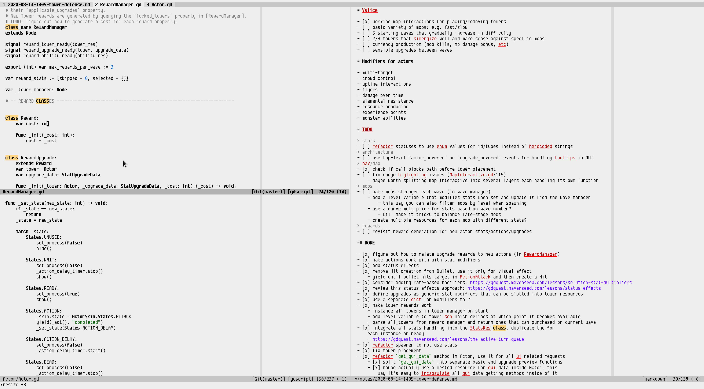

A work-in-progress, almost no-color light colorscheme for Vim with comfortable contrast.

Intended for both day and night usage with moderate screen brightness.

A "fake-busy" screenshot to give you an idea of some highlights in action.
Colors are used sparingly and mostly for UI-related higlights (search, errors, etc).

---

### Terminal colors

This is a subset of Envy's palette that can be used to achieve consistent colors in your terminal
emulator and Vim.

All colors are from the [256 Xterm color palette](https://jonasjacek.github.io/colors/).

#### 16 colors

| Color   | Normal    | Bright    |
|:--------|:----------|:----------|
| Black   | `#000000` | `#585858` |
| Red     | `#AF0000` | `#AF0000` |
| Green   | `#005F00` | `#005F00` |
| Yellow  | `#AF8700` | `#AF8700` |
| Blue    | `#005FD7` | `#005FD7` |
| Purple  | `#5F00FF` | `#5F00FF` |
| Cyan    | `#0087AF` | `#0087AF` |
| White   | `#B2B2B2` | `#B2B2B2` |

#### Extra colors

| Color     | Foreground | Background |
|:----------|:-----------|:-----------|
| Text      | `#000000`  | `#EEEEEE`  |
| Selection | `#FFFFFF`  | `#0087AF`  |
